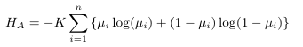
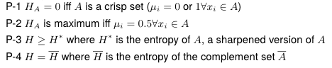
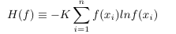

De-Luca & Termini's Fuzzy Entropy
===
*10th February 2016*

* 1972
* Based on Shannon's function
* 'n' membership functions μ

There are 4 properties to this Fuzzy Entropy:

> Paper:  De Luca and S. Termini, “A definition of a nonprobabilistic entropy in the setting of fuzzy sets theory,” Information and Control, vol. 20, no. 4, pp. 301–312, May 1972.

**P1** d(f) = degree of fuzziness. This is only ever 0 if f takes on I  exactly 0 or 1

**P2** d(f) assumes maximum value iff f = 1/2

**P3** d(f) => d(f*) where f* is a sharpened version of f

