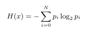
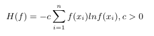
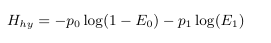
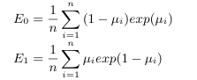

Types of Entropy
====
*4th February 2016*

> All  mathematical equations have been written in ShareLaTeX

## Shannon-Entropy / Information Entropy
Can be described as a measure of disorder.

## De Luca & Termini Fuzzy Entropy
Has the concept of a membership function

There are 4 properties to this Fuzzy Entropy:

## Shannon Fuzzy-Entropy
*Cannot access Sander's paper 'On measures of fuzziness'*

## Hybrid Entropy
Introduced by Pal and Pal, worked to improve upon De-Luca-Termini and Xie-Bedrosian.

The average likeliness to of interpreting a received symbol as 0:

### References

* [Fuzzy-Entropy based Image Congealing, N. MacParthalain and H. Strange](https://www.researchgate.net/profile/Neil_Mac_Parthalain/publication/261391235_Fuzzy-entropy_based_image_congealing/links/55ccaf7a08ae5b71d57aa6a5.pdf)
* [Fuzzy Entropy: A brief survey, S. Al-sharhan, F. Karray, W. Gueaieb, and 0. Basir](http://ieeexplore.ieee.org/stamp/stamp.jsp?tp=&arnumber=1008855)
