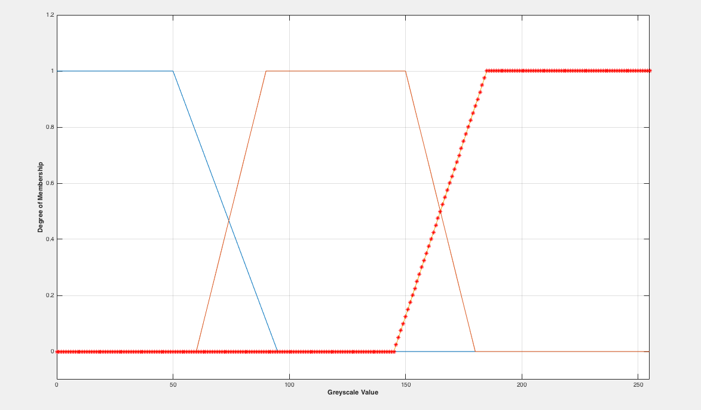
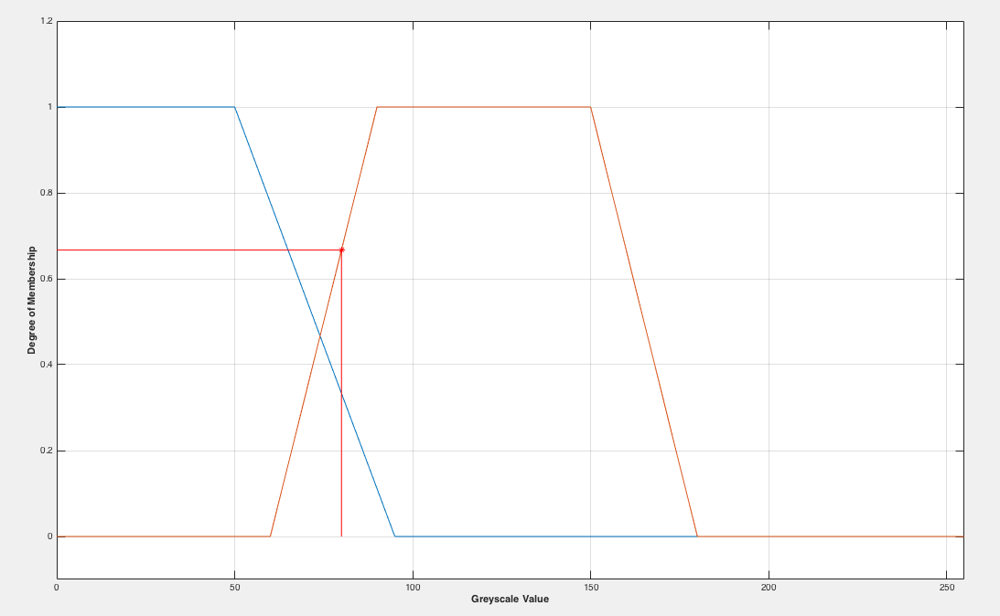
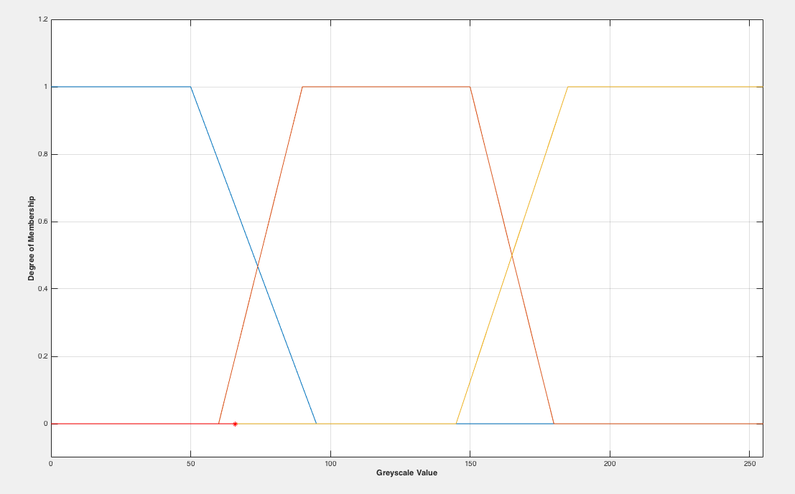

Membership
====
*12th February 2016*

## Binary

1 for black

0 for white

## Greyscale

**3 or 5 memberships: **
1. White
2. *White-grey*
3. Grey
4. *Grey-Black*
5. Black

> Fuzzy Logic Toolbox

Not 100% sure what has happened to this plot. It could be that it was missing a 'hold on' call, which ensures the line you've just plotted is not overwritten by the next line to be plotted.

This is a static variable passed into the exalmf function *(in this case x=80)*. As you can see this works fine with 2 trapmf graphs, however when a third is introduced, the y value is not computed *(as seen in screenshot below)*.

This screenshot not only shows issues when introducing a third trapmf graph, but the red marker is actually a variable called 'intensityValue' from the pixel 80,230. This shows just how easy it will be to pass in dynamic values as opposed to static *(like the previous example)*.
